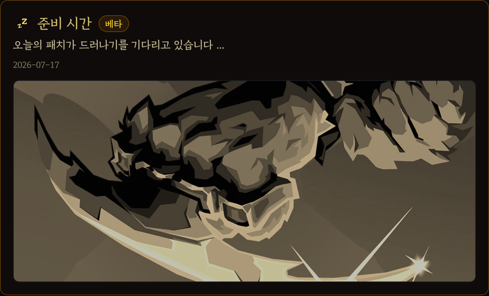
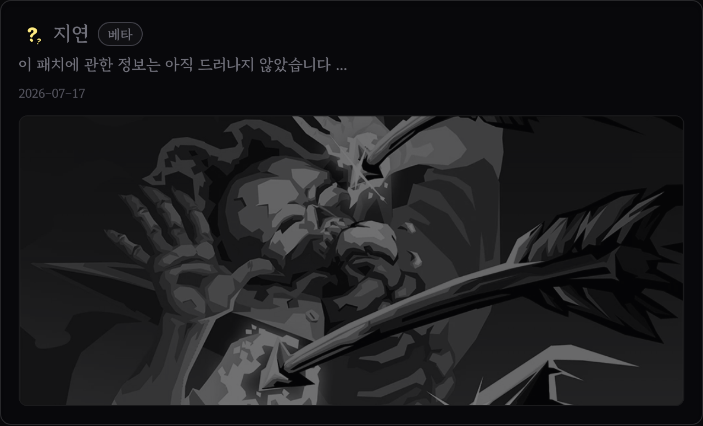

# 2026-07-09

## 개발/운영
- Cloudflare Workers 전환 이후 홈, 백과사전 목록, 패치 목록을 정적 자산 우선으로 서빙하도록 정리했습니다.
- 새 패치를 먼저 공개할 수 있도록 별도 패치 Worker와 대기 중 백과사전 링크 검사를 추가했습니다.
- 새 홈페이지 이전 안내 공지와 모든 페이지의 리디렉션 플로트를 제거했습니다.

## 패치노트
- Steam 패치가 아직 공개되지 않은 항목에 준비 시간과 지연 상태를 구분해 표시합니다. (개발 중)
- 공개 전 패치 카드는 준비 시간에는 황색, 지연 상태에는 회색 톤으로 표시되도록 정리했습니다.
- 아직 본 백과사전에 없는 패치 리소스 링크는 404 대신 hover 전용 미리보기로 닫히게 했습니다.

## 댓글
- 패치 라인마다 이야기를 쓰고, 이미 연결된 이야기를 먼저 확인할 수 있게 했습니다.
- 이야기 피드에 감정 반응 버튼과 화면 안에 머무는 반응 팔레트를 추가했습니다.

## 이거 아님 저거? (new)
- 카드, 유물, 포션 같은 리소스 두 개를 나란히 놓고 이유와 댓글을 남기는 장난감 상자 서비스를 추가했습니다.
- 대전 목록, 상세 화면, 작성 모달, 좋아요와 댓글 수 표시를 연결했습니다.
